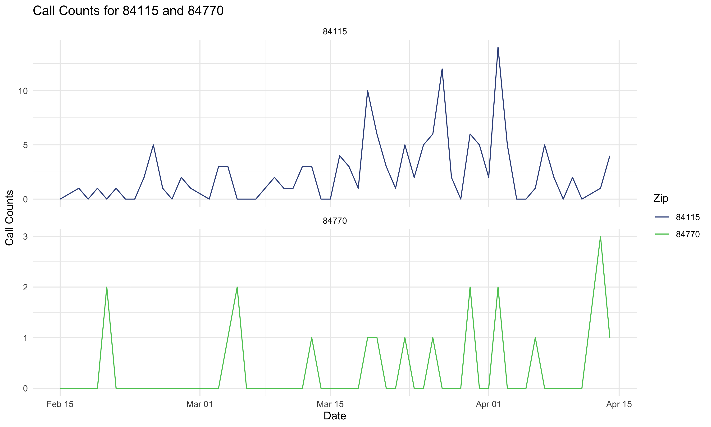

## What 211 Calls Are {#what-is-211 .compact-slide}

::: columns
::: {.column width="54%"}
### United Way 211

United Way 211 is a community referral system that connects people to services and support.

Examples include:

- **food insecurity and meal resources**
- housing and utility assistance
- mental health and crisis support
- transportation and other basic-needs services

### Why these calls matter

Changes in 211 calls can reflect changing community needs, access problems, or acute events.
:::

::: {.column width="46%"}
::: {.hero}
This talk focuses on 211 counts related to food insecurity and meal resources.
:::
:::
:::

## 211 Background {#background .compact-slide}

::: columns
::: {.column width="54%"}
### Why 211 counts are hard to interpret visually 

Daily 211 call counts move for a lot of reasons:

- Low call counts
- weekly usage patterns
- seasonality across the year
- gradual changes in underlying demand
- sudden events that create real spikes

### What we want

We want to distinguish the expected pattern from signals that may matter operationally.
:::

::: {.column width="46%"}
{fig-alt="Example 211 call count figure" width="100%"}
:::
:::

## Why A Model Is Helpful {#why-model .compact-slide}

::: {.hero}
The goal is not just to find high-count days.

The goal is to find days that are unusually high after accounting for the normal structure in 211 call counts.
:::

::: {.small-note}
The next slide is the main navigation slide. Each feature can be clicked to jump into a backup slide, and each backup slide links back here.
:::

## Five High-Level Features {#hub .hub-slide}

```{=html}
<div class="card-grid-five">
  <div class="card">
    <p><a href="#feature-1">Zeros and flexible counts</a></p>
    <p>Sparse series and overdispersed counts.</p>
  </div>
  <div class="card">
    <p><a href="#feature-2">Rate jumps and anomalies</a></p>
    <p>Rate jumps, ramp selection, and anomalies.</p>
  </div>
  <div class="card">
    <p><a href="#feature-3">Day-of-week effects</a></p>
    <p>Weekday effects in both counts and zero inflation.</p>
  </div>
  <div class="card">
    <p><a href="#feature-4">Seasonality</a></p>
    <p>Recurring seasonal patterns across the year.</p>
  </div>
  <div class="card">
    <p><a href="#feature-5">AR(1) correlation</a></p>
    <p>Nearby days can move together.</p>
  </div>
  <div class="card card-future">
    <p><a href="#feature-6">Future features and issues</a></p>
    <p>Spatial structure, trend changes, and computation.</p>
  </div>
</div>
```

::: {.hub-link}
[Stan (HMC) Implementation](#why-stan)
:::

## Feature 1: Many Zeros And Flexible Count Data {#feature-1}

### Main idea

211 series can include many zeros in some settings, and count variability can exceed what a simple Poisson model would allow.

### Why that matters

- the model can accommodate sparse count series
- it is flexible for overdispersed count data
- this makes the framework more useful across very different call settings

::: {.nav-row}
[Implementation snippet](#feature-1-code)

[Back to feature overview](#hub)
:::

## Feature 1 Code: Many Zeros And Flexible Count Data {#feature-1-code .code-slide}

```stan
vector<lower=0>[C] inv_phi;
vector[C] h0;

phi[c] = 1 / inv_phi[c];
logit_zi[c][t] = h0[c] + eta[c][dow[t]];

if (y[c, t] == 0) {
  target += log_mix(inv_logit(logit_zi[c][t]),
                    0,
                    neg_binomial_2_log_lpmf(0 | log_lambda[c][t], phi[c]));
} else {
  target += bernoulli_logit_lpmf(0 | logit_zi[c][t])
            + neg_binomial_2_log_lpmf(y[c, t] | log_lambda[c][t], phi[c]);
}
```

[Back to feature overview](#hub)

## Feature 2: Rate Jumps, Ramp Selection, And Anomalies {#feature-2}

### Main idea

The model can represent abrupt changes in the underlying rate, allows multiple smooth ramps, and uses a separate anomaly channel for local departures.

### Why that matters

- sustained jumps in the rate are not forced into one-day spike terms
- the model can adapt to more than one structural change over time
- local anomalies can still be highlighted after those broader changes are accounted for

::: {.nav-row}
[Implementation snippet](#feature-2-code)

[Back to feature overview](#hub)
:::

## Feature 2 Code: Rate Jumps, Ramp Selection, And Anomalies {#feature-2-code .code-slide}

```stan
vector[J] tau_raw = sort_asc(inv_logit(tau_unconstrained[c]));
for (j in 1:J) {
  tau[c][j] = 1 + (T - 1) * tau_raw[j];
  s[c][j]   = exp(log_s[c][j]);
}
d[c] = d_raw[c] .* lambda[c] * hs_tau[c];
kappa[c] = sigma_kappa[c] * kappa_raw[c];

for (t in 1:T) {
  real ramps = m0[c];
  for (j in 1:J) {
    ramps += d[c][j] * inv_logit((t - tau[c][j]) / s[c][j]);
  }
  log_lambda[c][t] = ramps + gamma[c][dow[t]] + z[c][t] + kappa[c][t] + season[c][t];
}
```

[Back to feature overview](#hub)

## Feature 3: Day-Of-Week Effects {#feature-3}

### Main idea

211 activity differs systematically across the week, so the model includes day-of-week effects in both the count part of the model and the zero-inflation part.

### Why that matters

- routine weekday differences are not mistaken for meaningful events
- comparisons across days become fairer
- the chance of observing zeros can also vary by weekday

::: {.nav-row}
[Implementation snippet](#feature-3-code)

[Back to feature overview](#hub)
:::

## Feature 3 Code: Day-Of-Week Effects {#feature-3-code .code-slide}

```stan
array[C] vector[6] gamma_raw;
array[C] vector[7] gamma;
array[C] vector[6] eta_raw;
array[C] vector[7] eta;

gamma[c][1:6] = gamma_raw[c];
gamma[c][7]   = -sum(gamma_raw[c]);
eta[c][1:6] = eta_raw[c];
eta[c][7]   = -sum(eta_raw[c]);

for (t in 1:T) {
  logit_zi[c][t] = h0[c] + eta[c][dow[t]];
  log_lambda[c][t] = ramps + gamma[c][dow[t]] + z[c][t] + kappa[c][t] + season[c][t];
}
```

[Back to feature overview](#hub)

## Feature 4: Seasonality {#feature-4}

### Main idea

The model includes a seasonal component so recurring patterns across the year aren't identified as anomalies.

### Why that matters

- predictable seasonal shifts are absorbed before detection decisions
- anomalies are judged relative to the expected time of year
- this is especially useful when call patterns drift across seasons

::: {.nav-row}
[Implementation snippet](#feature-4-code)

[Back to feature overview](#hub)
:::

## Feature 4 Code: Seasonality {#feature-4-code .code-slide}

```stan
matrix[T, K] C_fourier;
matrix[T, K] S_fourier;

for (t in 1:T) {
  for (k in 1:K) {
    real omega = 2 * pi() * k / P;
    C_fourier[t, k] = cos(omega * t);
    S_fourier[t, k] = sin(omega * t);
  }
}

season[c] = rep_vector(0, T);
if (K > 0) {
  season[c] = C_fourier * a_cos[c] + S_fourier * b_sin[c];
}
```

[Back to feature overview](#hub)

## Feature 5: AR(1) Correlation {#feature-5}

### Main idea

Nearby days are allowed to be correlated through an AR(1) structure, rather than assuming each day is independent after adjustment.

### Why that matters

- short runs of elevated or depressed counts are modeled more realistically
- the model is less likely to overreact to small clusters of related days
- residual structure is separated from truly unusual single-day behavior

::: {.nav-row}
[Implementation snippet](#feature-5-code)

[Back to feature overview](#hub)
:::

## Feature 5 Code: AR(1) Correlation {#feature-5-code .code-slide}

```stan
vector<lower=-1, upper=1>[C] rho;
vector<lower=0>[C] sigma_z;
array[C] vector[T] eps_z;

z[c][1] = eps_z[c][1] * (sigma_z[c] / sqrt(1 - square(rho[c])));
for (t in 2:T) {
  z[c][t] = rho[c] * z[c][t - 1] + sigma_z[c] * eps_z[c][t];
}
```

[Back to feature overview](#hub)

## Future Features And Issues {#feature-6}

### Main idea

Two natural extensions are:

- a spatial component so nearby counties or ZIPs can share information
- more flexible trend changes so the model can represent evolving slopes, not only ramps
- a faster computational strategy for repeated fitting across Utah ZIP codes over time

### Why that matters

- spatial borrowing could stabilize estimates in sparse areas
- neighboring regions may show related patterns during shared events
- trend-change components could capture gradual accelerations or slowdowns more naturally
- computational time becomes a real issue when fitting many ZIP codes repeatedly across rolling dates

::: {.nav-row}
[Implementation notes](#feature-6-code)

[Back to feature overview](#hub)
:::

## Notes: Future Features And Issues {#feature-6-code .code-slide}

These are extensions rather than current features.

### Possible directions

- add a spatial random effect or adjacency-based structure across counties or ZIPs
- replace or augment ramps with components that allow changes in slope over time
- combine those additions with the current anomaly channel rather than replacing it
- reduce runtime for statewide ZIP-level monitoring through approximation, parallelization, or a more scalable model structure

[Back to feature overview](#hub)

## Why Stan Is Useful Here {#why-stan .compact-slide}

::: columns
::: {.column width="54%"}
### Why implement this in Stan

This model combines several pieces at once:

- zero inflation and flexible count likelihoods
- smooth rate changes
- anomaly terms
- day-of-week effects
- seasonality
- AR(1) dependence

Stan makes it practical to estimate all of these pieces jointly in one coherent model.
:::

::: {.column width="46%"}
### Why that matters computationally

- Hamiltonian Monte Carlo is well suited for a rich continuous-parameter model
- uncertainty is propagated across all components together
- transformed-data tricks, vectorization, and non-centered parameterizations help with efficiency and stability

This would be much harder to fit well with ad hoc step-by-step estimation or with a frequentist approach.
:::
:::

[Back to feature overview](#hub)
