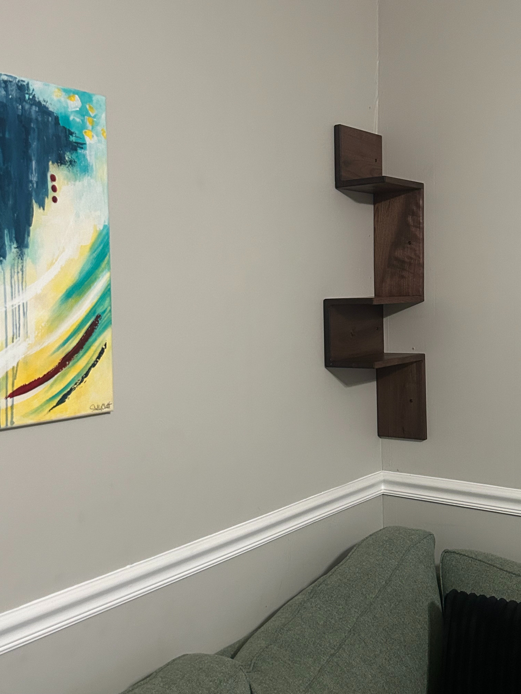
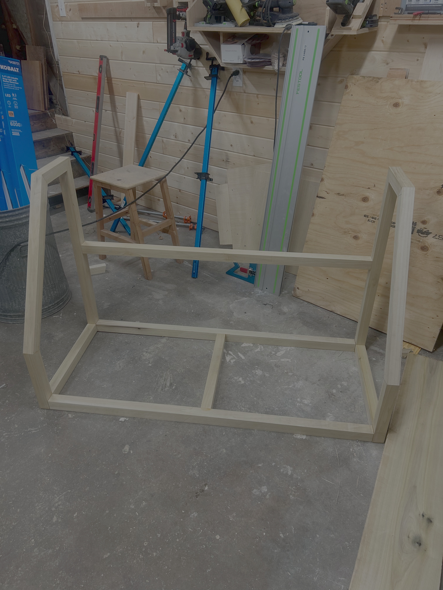
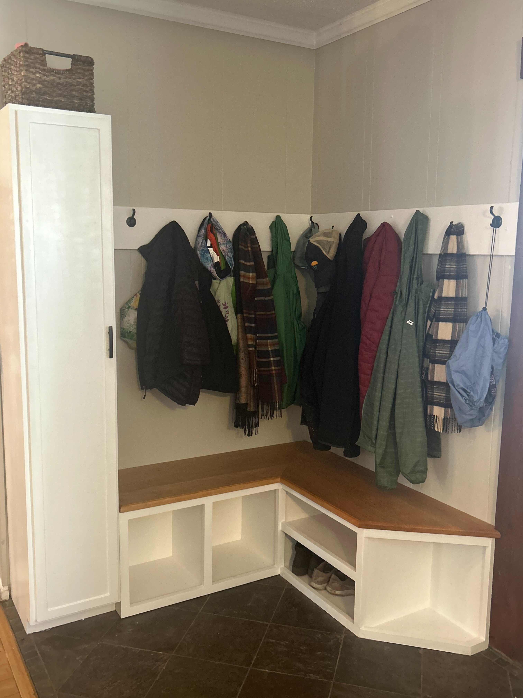
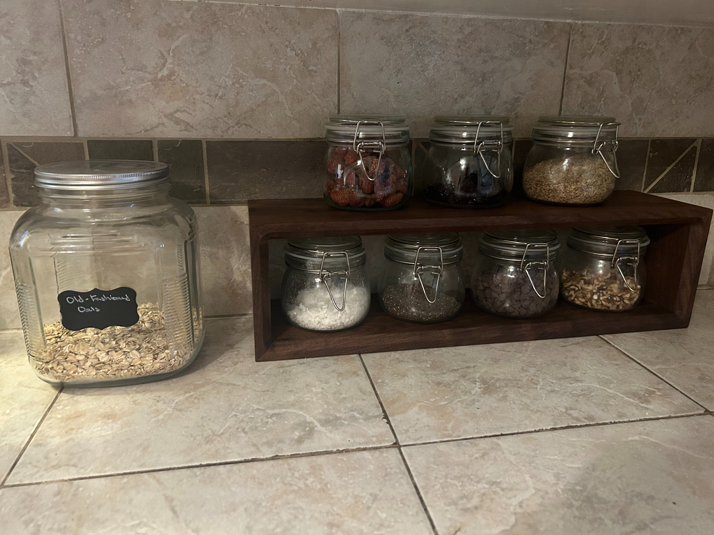
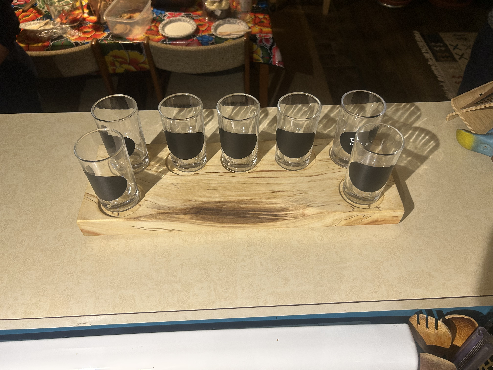

::: {=html}

:::

::: {.wood-intro}
A small collection of practical builds: shelves, benches, storage, and other projects where the design is mostly in the joinery and finish.
:::

  <figure class="wood-card">
    <button class="wood-open" type="button" data-full="images/project1.jpg" aria-label="Open walnut corner shelves image">
      <picture>
        <source srcset="images/project1.webp" type="image/webp">
        
      </picture>
    </button>
    <figcaption>
      <strong>Walnut corner shelves</strong>
      Compact wall storage with a stepped profile.
    </figcaption>
  </figure>
  <figure class="wood-card">
    <button class="wood-open" type="button" data-full="images/project2.jpg" aria-label="Open bench frame in progress image">
      <picture>
        <source srcset="images/project2.webp" type="image/webp">
        
      </picture>
    </button>
    <figcaption>
      <strong>Bench frame in progress</strong>
      A shop-stage look at layout, proportion, and structure.
    </figcaption>
  </figure>
  <figure class="wood-card">
    <button class="wood-open" type="button" data-full="images/project3.jpg" aria-label="Open entryway bench and coat rail image">
      <picture>
        <source srcset="images/project3.webp" type="image/webp">
        
      </picture>
    </button>
    <figcaption>
      <strong>Entryway bench and rail</strong>
      Built-in storage for the daily pileup of coats and bags.
    </figcaption>
  </figure>
  <figure class="wood-card">
    <button class="wood-open" type="button" data-full="images/project4.jpg" aria-label="Open kitchen shelf image">
      <picture>
        <source srcset="images/project4.webp" type="image/webp">
        
      </picture>
    </button>
    <figcaption>
      <strong>Kitchen shelf</strong>
      A narrow shelf for keeping jars useful and visible.
    </figcaption>
  </figure>
  <figure class="wood-card">
    <button class="wood-open" type="button" data-full="images/project5.jpeg" aria-label="Open serving flight board image">
      <picture>
        <source srcset="images/project5.webp" type="image/webp">
        
      </picture>
    </button>
    <figcaption>
      <strong>Serving flight board</strong>
      A small, tactile build for gathering around a table.
    </figcaption>
  </figure>

  <button class="lightbox-close" type="button">Close</button>
  

